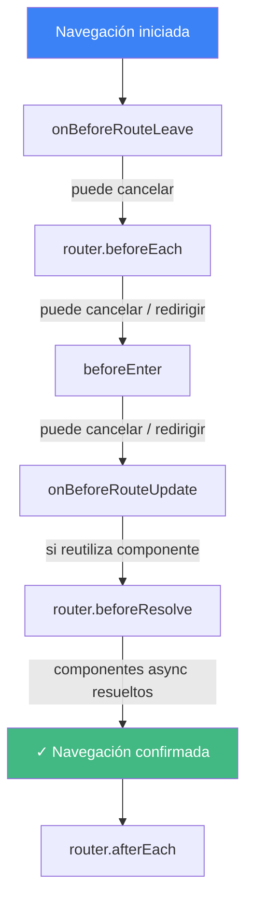

Vue Router mapea rutas URL a componentes. Cuando la URL cambia, Vue Router renderiza el componente correspondiente sin recargar la página completa. Los navigation guards son hooks que se ejecutan antes, durante o después de cada navegación, permitiéndote controlar el acceso, cancelar navegaciones o ejecutar efectos secundarios.

## Configuración básica

```ts
import { createRouter, createWebHistory } from 'vue-router'

const router = createRouter({
  history: createWebHistory(),
  routes: [
    { path: '/', component: () => import('./views/Home.vue') },
    {
      path: '/dashboard',
      component: () => import('./views/Dashboard.vue'),
      meta: { requiresAuth: true }
    },
    {
      path: '/:pathMatch(.*)*',
      component: () => import('./views/NotFound.vue')
    }
  ]
})
```

`createWebHistory()` usa la History API del navegador para URLs limpias (`/dashboard`). `createWebHashHistory()` usa URLs basadas en hash (`/#/dashboard`) para entornos sin reescritura de URLs en el servidor.

Cada `() => import(...)` es un import dinámico que crea un chunk JavaScript separado, cargado solo cuando el usuario navega a esa ruta.

## Navigation guards

Los guards interceptan las navegaciones en tres niveles: global, por ruta y dentro del componente.

### Guards globales

Se ejecutan en cada navegación de la app:

```ts
router.beforeEach((to, from) => {
  if (to.meta.requiresAuth && !isAuthenticated()) {
    return { path: '/login', query: { redirect: to.fullPath } }
  }
})
```

Devolver un objeto de ruta redirige. Devolver `false` cancela la navegación. No devolver nada (o devolver `true`) la permite.

### Guards por ruta

Se ejecutan solo para una ruta específica:

```ts
const routes = [
  {
    path: '/admin',
    component: () => import('./views/Admin.vue'),
    beforeEnter: (to, from) => {
      if (!isAdmin()) return { path: '/' }
    }
  }
]
```

### Guards dentro del componente

Se ejecutan dentro del componente al que se navega o del que se sale:

```vue
<script setup>
import { onBeforeRouteLeave, onBeforeRouteUpdate } from 'vue-router'

onBeforeRouteLeave((to, from) => {
  if (hasUnsavedChanges.value) {
    return confirm('¿Salir sin guardar?')
  }
})

onBeforeRouteUpdate((to, from) => {
  // mismo componente, diferentes params (ej. /users/1 → /users/2)
  loadUser(to.params.id)
})
</script>
```

<PlaygroundLink code="<script setup>
import { onBeforeRouteLeave, onBeforeRouteUpdate } from 'vue-router'
&#10;onBeforeRouteLeave((to, from) => {
  if (hasUnsavedChanges.value) {
    return confirm('¿Salir sin guardar?')
  }
})
&#10;onBeforeRouteUpdate((to, from) => {
  // mismo componente, diferentes params (ej. /users/1 → /users/2)
  loadUser(to.params.id)
})
</script>" />

## Orden de ejecución de los guards

Al navegar de `/a` a `/b`:



1. `onBeforeRouteLeave` en el componente que se abandona
2. `router.beforeEach` (global)
3. `beforeEnter` en la ruta destino (por ruta)
4. `onBeforeRouteUpdate` si se reutiliza un componente
5. `router.beforeResolve` (global, después de resolver componentes asíncronos)
6. Navegación confirmada
7. `router.afterEach` (global, no se puede cancelar)

## Route meta

Adjunta datos arbitrarios a las rutas mediante `meta`. Los guards y componentes pueden leerlos:

```ts
const routes = [
  {
    path: '/settings',
    component: () => import('./views/Settings.vue'),
    meta: { requiresAuth: true, title: 'Settings' }
  }
]

router.afterEach((to) => {
  document.title = (to.meta.title as string) ?? 'My App'
})
```

## Patrones comunes

| Necesidad                                           | Guard                | Dónde            |
| --------------------------------------------------- | -------------------- | ---------------- |
| Proteger rutas autenticadas                         | `beforeEach`         | Global           |
| Evitar salir de formularios sin guardar             | `onBeforeRouteLeave` | En el componente |
| Redirigir URLs antiguas                             | `beforeEnter`        | Por ruta         |
| Analytics/seguimiento de página                     | `afterEach`          | Global           |
| Establecer título de página                         | `afterEach`          | Global           |
| Esperar datos asíncronos antes de mostrar la página | `beforeResolve`      | Global           |

Ver también: [¿Cómo implementar autenticación con Vue Router?](/es/q/auth-with-vue-router) · [¿Cómo funciona el routing basado en archivos en Nuxt?](/es/q/nuxt-file-based-routing) · [¿Cómo implementar lazy loading?](/es/q/lazy-loading-code-splitting)

## Referencias

- [Navigation Guards](https://router.vuejs.org/guide/advanced/navigation-guards.html) - Vue Router docs
- [Route Meta Fields](https://router.vuejs.org/guide/advanced/meta.html) - Vue Router docs
- [Getting Started](https://router.vuejs.org/guide/) - Vue Router docs
